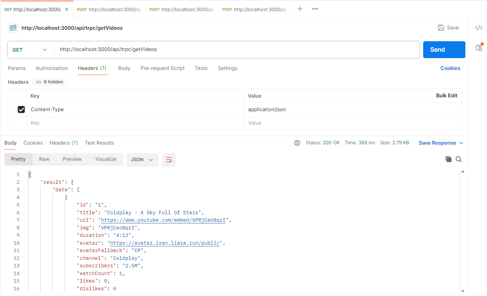
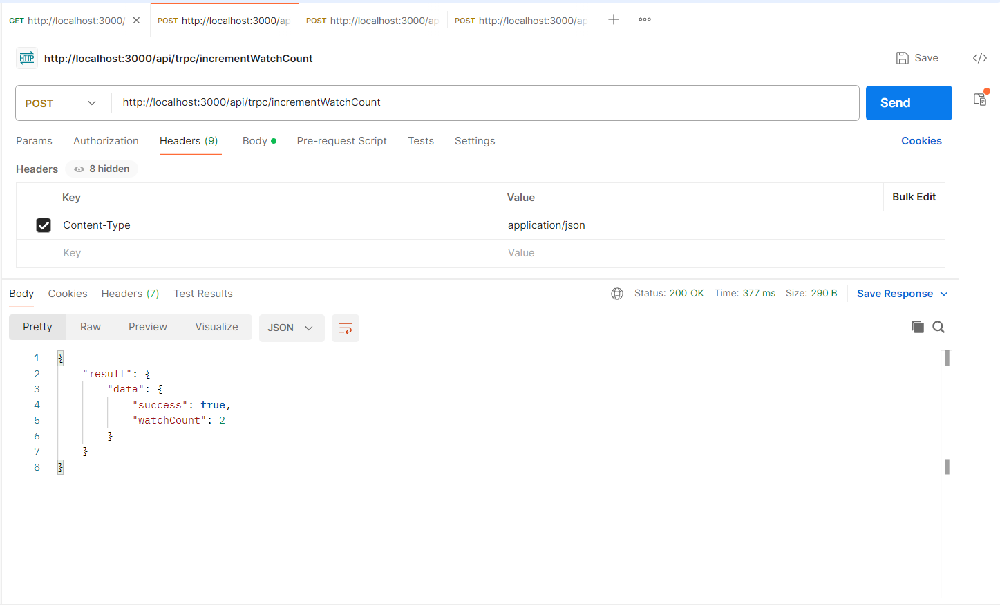
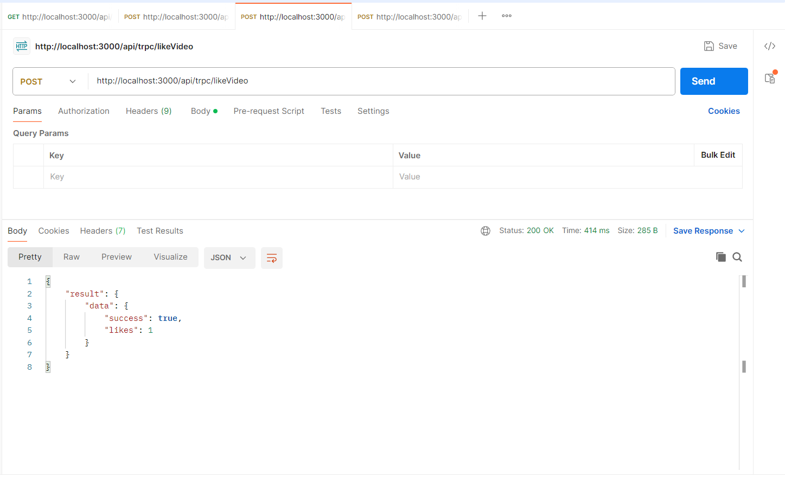
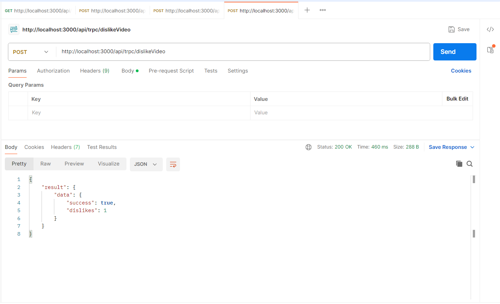

# Reproductor de Videos

## Introducción

Aplicación web, realizada como parte de una prueba técnica, que une en un reproductor de vídeos las siguientes tecnologías: Next.js, Tailwind CSS, Shadcn y tRPC. Los usuarios pueden reproducir cualquier video individualmente, viendo una lista de todos ellos, contabilizando sus vistas, likes y dislikes.

## Tecnologías Utilizadas

- Next.js <a href="https://nextjs.org/docs" target="_blank">Documentación de Next.js</a>
- Tailwind CSS <a href="https://tailwindcss.com/docs/installation" target="_blank">Documentación de Tailwind CSS</a>
- Shadcn <a href="https://ui.shadcn.com/docs" target="_blank">Documentación de Shadcn</a>
- tRPC <a href="https://trpc.io/docs/quickstart" target="_blank">Documentación de tRPC</a>
- TypeScript <a href="https://www.typescriptlang.org/docs/handbook/typescript-in-5-minutes.html" target="_blank">Documentación de TypeScript</a>

## Otras Librerías Utilizadas

- Lucide Icons
- React Hot Toast
- React Icons

## Instrucciones para Instalación

1. Clona el repositorio:

```
git clone https://github.com/JuampiRibero/video-watch-player.git
```

2. Accede a la raíz del del proyecto:

```
cd video-watch-player
```

3. Instala todas las dependencias:

```
npm install
```

4. Corre el servidor de desarrollo:

```
npm run dev
```

5. Abre <a href="http://localhost:3000" target="_blank">http://localhost:3000</a> con tu navegador.

## API Endpoints

- GET /api/trpc/getVideos → Recupera lista de videos con todos los datos.

  

- POST /api/trpc/incrementWatchCount → Incrementa el contador de vistas de un video.

  En el body, ingresar por ejemplo:

  ```
  {
  "id": "1"
  }
  ```

  

- POST /api/trpc/likeVideo → Incrementa el contador de likes de un video.

  En el body, ingresar por ejemplo:

  ```
  {
  "id": "1"
  }
  ```

  

- POST /api/trpc/dislikeVideo → Incrementa el contador de dislikes de un video.

  En el body, ingresar por ejemplo:

  ```
  {
  "id": "1"
  }
  ```

  

### Autor

Juan Pablo Ribero Mazzoni
